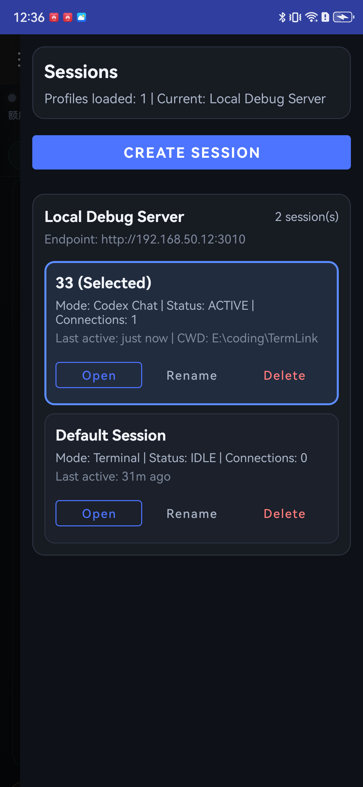
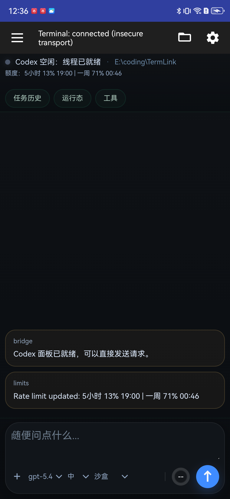
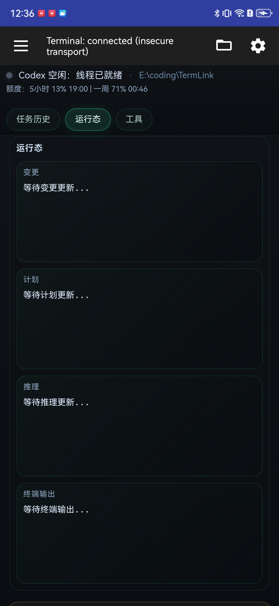
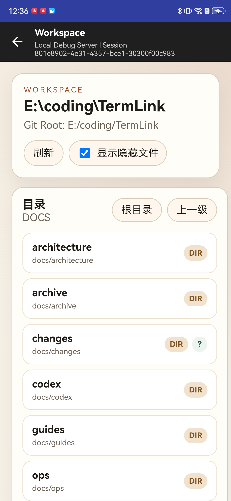

# TermLink

[English Version / 英文版](README.md)

TermLink 是一个移动优先的 AI 终端工作台。它把远端终端、Codex 协作、线程历史、审批流和工作区浏览收口到同一条 Android 主链路里，而不是把产品做成单纯聊天窗口或纯终端模拟器。

当前仓库中的实现重点是：

- Android 原生壳：`Sessions / Terminal / Settings / Workspace`
- Codex WebView 工作区：状态条、任务历史、运行态、工具区、slash、计划模式、审批弹层、上下文窗口
- 独立 Workspace 页面：目录浏览、文件查看、Diff、隐藏文件切换
- Sessions 本地缓存与离线回显
- 基础安全能力：BasicAuth、mTLS、发布配置检查

## 当前界面

### Android Sessions



原生会话抽屉支持跨 profile 列表、创建、打开、重命名、删除；当前已包含本地缓存回显与弱网失败保留。

### Codex 主工作区



Codex 页面保持“终端仍然在场”的混合工作区语义：上方是任务状态与二级入口，中部是日志流，下方是高频输入与 next-turn 覆盖控制。

### Codex 运行态



运行态已按 `diff / plan / reasoning / terminal output` 四区块组织，并作为二级入口收口，不占首页主视图。

### Workspace 独立页



Workspace 通过独立 `WorkspaceActivity` 承载，面向 Codex 会话提供固定 `workspaceRoot` 下的目录浏览、文本查看与统一 Diff。

## 当前已实现能力

### Android 主链路

- `MainShellActivity` 作为原生入口，负责顶栏、Sessions 抽屉、Settings、Workspace 入口和 WebView 容器。
- Android Terminal 使用 `public/terminal_client.html`；Codex 使用 `public/codex_client.html`；Workspace 使用独立 `WorkspaceActivity + public/workspace.html`。
- 会话创建支持 `terminal` / `codex` 分流，Codex 会话可携带 `cwd` 和 `workspaceRoot` 相关上下文。

### Codex 工作区

- 顶部轻量状态条展示当前状态、`cwd` 摘要与限额信息。
- 二级入口已收口为 `任务历史 / 运行态 / 工具`。
- 输入区支持 slash、`@` 文件提及、图像 URL、单次模型覆盖、单次推理强度覆盖、单次沙盒覆盖。
- `/plan`、任务历史、工具区、阻塞式命令确认弹层和上下文窗口已接通当前主链路。

### Workspace 浏览

- 服务端提供 `workspace/meta|tree|file|file-segment|file-limited|status|diff` 接口。
- 工作区访问边界固定在会话 `workspaceRoot` 内，默认优先进入 `DOCS / docs / root`。
- 文件查看支持完整预览、截断预览、分段查看、受限查看和 Git Diff。

### 会话与缓存

- `GET/POST/PATCH/DELETE /api/sessions` 已用于 Android 原生会话页。
- Sessions 页面支持首屏本地缓存回显、远端成功覆盖缓存、失败时 stale 提示和创建/删除/重命名后的缓存同步。
- 会话元数据持久化到 `data/sessions.json`。

### 安全与发布

- 服务端默认启用 BasicAuth。
- Android 支持按配置启用 mTLS 客户端证书。
- release 前需执行 `npm run android:check-release-config`，避免不安全的 `http/ws` 配置进入发布包。

## 本地运行

### 环境要求

- Node.js 18+
- npm
- JDK 21
- Android Studio 或可用的 `adb`

### 启动服务端

1. 安装依赖：

```bash
npm install
```

2. 复制环境变量：

```bash
copy .env.example .env
```

3. 启动本地服务：

```bash
npm run dev
```

默认健康检查地址为 `http://localhost:3010/api/health`。

`.env.example` 当前默认开启 BasicAuth；仅可信本地环境才应关闭认证或继续使用默认账号。

## Android 调试最短路径

1. 确认设备在线：

```bash
adb devices
```

2. 确保本地服务可用：

```powershell
powershell -ExecutionPolicy Bypass -File ./skills/android-local-build-debug/scripts/ensure-local-server.ps1
```

3. 构建 debug APK：

```powershell
powershell -ExecutionPolicy Bypass -File ./skills/android-local-build-debug/scripts/build-debug-apk.ps1
```

4. 安装并启动：

```powershell
powershell -ExecutionPolicy Bypass -File ./skills/android-local-build-debug/scripts/install-debug-apk.ps1 -Serial <adb-serial>
```

更多 Android 说明见 `docs/guides/android-development.md`。

## 项目结构

```text
TermLink/
├── android/                 # Android 原生壳、Sessions/Settings/Workspace Activity
├── public/                  # terminal/codex/workspace WebView 静态页面
├── src/                     # Express、WebSocket、PTY、sessions/workspace 服务端
├── tests/                   # Node 测试
├── docs/                    # 主线文档、REQ/PLAN/CR、指南与运维文档
├── skills/                  # 项目本地 skills
└── data/                    # 会话持久化数据
```

## 关键文档

- 文档入口：`docs/README.md`
- 产品主线：`docs/product/PRODUCT_REQUIREMENTS.md`
- Codex 主 REQ：`docs/product/requirements/REQ-20260309-codex-capability-mvp.md`
- Workspace 主 REQ：`docs/product/requirements/REQ-20260318-WS-0001-docs-exp.md`
- Android 开发指南：`docs/guides/android-development.md`
- 变更记录索引：`docs/changes/records/INDEX.md`

## 当前范围说明

- 本 README 只描述仓库里已经实现并可运行的能力。
- `docs/codex/STITCH2_TERMLINK_CODEX_MOBILE_WORKSPACE_PROMPT.md` 是后续设计输入，不代表当前 UI 已完全按该设计稿实现。
- 浏览器端仍保留 `public/terminal.html`；Android 主链路优先以原生壳 + WebView 为准。

## 安全提醒

- 非开发环境不要继续使用默认 `AUTH_USER=admin` / `AUTH_PASS=admin`。
- 若启用 elevated mode，必须同时满足对应安全门禁与审计要求。
- Android release 包必须使用 HTTPS/WSS，并先通过 `npm run android:check-release-config`。
