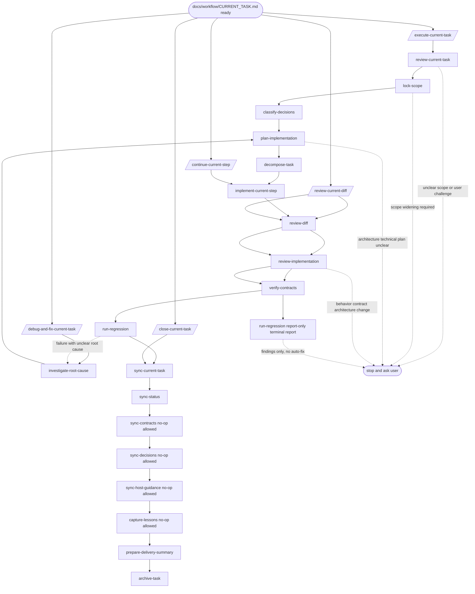

# docs/workflow/WORKFLOW_GUIDE.md

## 使用规则

- 本文件说明 workflow-system 的日常操作顺序：什么时候读哪些治理文档、什么时候调用哪些 skill。
- 本文件只解释使用方法，不定义字段、章节、错误码或 gate 语义。
- 详细文档结构以 `.workflow-system/FILE_SCHEMAS.md` 为准；skill 的 reads / writes / handoff 以对应 `SKILL.md` 为准。
- 如果本文件与 `.workflow-system/WORKFLOW_PROTOCOL.md`、`.workflow-system/FILE_SCHEMAS.md` 或具体 skill frontmatter 冲突，以规范源和 skill frontmatter 为准。
- `docs/workflow/generated/workflow-skills/**` 与 `docs/workflow/generated/workflow-docs/**` 是 source-repo reference render，不是安装到 target project 后的 live runtime artifacts；target repo 需要重渲染时，由 workflow-system 源仓库通过 `WORKFLOW_SYSTEM_ROOT=<target-repo>` 按目标项目的 `.workflow-system/PROJECT_PROFILE.yaml` 生成。

## 目录分类规则

| 目录 | 分类依据 | 典型文档 |
| --- | --- | --- |
| 根目录 | 宿主入口与系统控制文件，只保留 host/runtime 必须从根读取的入口 | `README.md`、`AGENTS.md`、`CLAUDE.md`、`.workflow-system/**` |
| `docs/workflow/` | workflow 治理文档、目录索引、registry 与 source-repo reference render | `docs/workflow/DOCUMENT_CATALOG.md`、`docs/workflow/WORKFLOW_GUIDE.md`、`docs/workflow/ROADMAP.md`、`docs/workflow/STATUS.md`、`generated/**` |
| `docs/designs/` | 新项目设计基线与设计展开文档 | `architecture.md`、`database.md`、`domain-model.md`、`api-contracts.md` |
| `docs/adoption/` | 老项目事实盘点、风险登记与接管材料 | `architecture-inventory.md`、`database-inventory.md`、`ADOPTION_REPORT.md` |

## 文档速查

| 文档 | 作用 | 主要使用时机 |
| --- | --- | --- |
| `docs/workflow/DOCUMENT_CATALOG.md` | 文档目录协议、分类规则和快速查表入口 | 不确定文档该去哪里读写时 |
| `docs/workflow/STATUS.md` | 当前项目状态、稳定模块、风险和下一检查点 | 开始任务前、任务结束后 |
| `docs/workflow/ROADMAP.md` | 里程碑、当前窗口、候选事项和跨阶段风险 | 规划阶段、排优先级时 |
| `docs/workflow/CURRENT_TASK.md` | 本轮任务目标、范围、验收、设计约束、发布后验证、回归和执行记录 | 每轮工作前、每步完成后 |
| `docs/workflow/CONTRACTS.md` | 稳定接口、架构边界、目录职责和不可破坏约束 | 实现前、审核前、契约复核前 |
| `docs/workflow/DECISIONS.md` | 已确认的架构、产品、口味、暂缓和否决决策 | 涉及选择、取舍或改方向时 |
| `docs/workflow/LESSONS.md` | 可复用经验、踩坑记录和触发信号 | 调试前、复盘时、遇到类似问题时 |
| `docs/workflow/BASELINES.md` | 发布、兼容、安全、部署、性能和 gate 基线 | 涉及发布 gate、兼容窗口或非功能要求时 |
| `docs/workflow/TASK_SUMMARY.md` | 交付摘要结构参考 | 交付前准备摘要时 |
| `docs/workflow/TASK_ARCHIVE.md` | 任务归档结构参考 | 任务完成后、追溯历史时 |

## Skill 速查

| 场景 | 使用 skill | 主要读取 | 主要产出 |
| --- | --- | --- | --- |
| 新项目设计基线 | `/design-baseline-init` | 原始需求、用户目标、技术栈偏好、交付约束 | `docs/workflow/ROADMAP.md`、`docs/designs/architecture.md`、`docs/designs/database.md`、`docs/designs/**`、`docs/workflow/BASELINES.md` / `docs/workflow/DECISIONS.md` 草案 |
| 对齐已有 workflow 资产 | `/realign-workflow-assets` | 当前 `.workflow-system/PROJECT_PROFILE.yaml`、已有 `docs/workflow/**` / `docs/designs/**` / `docs/adoption/**`、legacy root docs、runtime skill 目录、`AGENTS.md` / `CLAUDE.md` | 整理后的 workflow 文档目录、同步后的 runtime skills、更新后的 `AGENTS.md` / `CLAUDE.md` / `.workflow-system/PROJECT_PROFILE.yaml` |
| 初始化新项目治理基线 | `/greenfield-init` | 已确认设计基线、用户目标、技术栈偏好、`.workflow-system/PROJECT_PROFILE.yaml` scaffold | 首版 `.workflow-system/PROJECT_PROFILE.yaml`、`AGENTS.md`、`CLAUDE.md`、`docs/workflow/ROADMAP.md`、`docs/workflow/CONTRACTS.md`、`docs/workflow/BASELINES.md`、`docs/workflow/STATUS.md`、`docs/workflow/DECISIONS.md` |
| 老项目事实盘点 | `/legacy-inventory` | 由 profile / 仓库事实确定的代码目录、README/docs、package scripts、数据库和部署线索 | `docs/adoption/architecture-inventory.md`、`docs/adoption/database-inventory.md`、`docs/adoption/**`、`docs/workflow/ROADMAP.md` 缺口草案 |
| 接管老项目治理基线 | `/adopt-existing-project` | `legacy-inventory` 产物、现有仓库事实、用户确认信息 | 首版 `.workflow-system/PROJECT_PROFILE.yaml`、`AGENTS.md`、`CLAUDE.md`、`docs/workflow/ROADMAP.md`、`docs/workflow/CONTRACTS.md`、`docs/workflow/BASELINES.md`、`docs/workflow/STATUS.md`、`docs/workflow/DECISIONS.md`，必要时更新 `docs/adoption/ADOPTION_REPORT.md` |
| 执行当前任务编排 | `/execute-current-task` | `docs/workflow/CURRENT_TASK.md`、`docs/workflow/CONTRACTS.md`、`docs/workflow/DECISIONS.md`、`docs/workflow/STATUS.md` | 自动进入 review-current-task → lock-scope → classify-decisions → plan-implementation → decompose-task → implement/review/regression 链 |
| 创建任务包 | `/create-current-task` | `.workflow-system/PROJECT_PROFILE.yaml`、`docs/workflow/CONTRACTS.md`、`docs/workflow/STATUS.md`、`docs/workflow/DECISIONS.md`、用户需求 | `docs/workflow/CURRENT_TASK.md` |
| 审查任务包 | `/review-current-task` | `docs/workflow/CURRENT_TASK.md`、`.workflow-system/PROJECT_PROFILE.yaml`、`docs/workflow/CONTRACTS.md`、`docs/workflow/DECISIONS.md`、`docs/workflow/STATUS.md` | 修订后的任务边界、验收、设计约束和风险 |
| 锁定范围 | `/lock-scope` | `docs/workflow/CURRENT_TASK.md`、`docs/workflow/CONTRACTS.md`、`docs/workflow/DECISIONS.md` | Safety mode、Allowed Files、Forbidden Files、Conditional Files、Dangerous surfaces、Unlock / widening conditions |
| 分类决策 | `/classify-decisions` | `docs/workflow/CURRENT_TASK.md`、`docs/workflow/DECISIONS.md` | Mechanical / Taste / User challenge 分类 |
| 分析实现方案 | `/plan-implementation` | `docs/workflow/CURRENT_TASK.md`、`docs/workflow/CONTRACTS.md`、`docs/workflow/DECISIONS.md`、`docs/workflow/LESSONS.md`、`.workflow-system/PROJECT_PROFILE.yaml` | 架构影响、技术路线、候选方案、风险、兼容性和验证策略 |
| 拆解步骤 | `/decompose-task` | `docs/workflow/CURRENT_TASK.md`、`docs/workflow/CONTRACTS.md`、`docs/workflow/DECISIONS.md` | 小步实施计划 |
| 继续当前步骤编排 | `/continue-current-step` | `docs/workflow/CURRENT_TASK.md`、`docs/workflow/CONTRACTS.md`、`docs/workflow/DECISIONS.md`、`docs/workflow/LESSONS.md` | implement-current-step → review-diff → review-implementation → verify-contracts → run-regression → sync-current-task |
| 调试并修复编排 | `/debug-and-fix-current-task` | `docs/workflow/CURRENT_TASK.md`、`docs/workflow/CONTRACTS.md`、`docs/workflow/DECISIONS.md`、`docs/workflow/LESSONS.md` | investigate-root-cause → plan-implementation → decompose-task → implement-current-step → review / verify / regression |
| 调查根因 | `/investigate-root-cause` | `docs/workflow/CURRENT_TASK.md`、代码和日志线索 | Symptom、Reproduction、Root cause hypothesis、Evidence、Minimal fix path、Regression check |
| 实现当前步骤 | `/implement-current-step` | `docs/workflow/CURRENT_TASK.md`、`docs/workflow/CONTRACTS.md`、`docs/workflow/DECISIONS.md`、`docs/workflow/LESSONS.md` | 代码改动、dangerous command gate、验证结果、执行记录 |
| 只读审查编排 | `/review-current-diff` | `docs/workflow/CURRENT_TASK.md`、`docs/workflow/CONTRACTS.md`、`docs/workflow/DECISIONS.md`、`docs/workflow/LESSONS.md`、`.workflow-system/PROJECT_PROFILE.yaml` | review-diff → review-implementation → verify-contracts → run-regression(report-only) |
| 审查 diff | `/review-diff` | `docs/workflow/CURRENT_TASK.md`、`docs/workflow/CONTRACTS.md`、`docs/workflow/DECISIONS.md`，以及当前 diff 上下文 | scope drift / decision drift / safety boundary review / 回归风险 |
| 审查实现质量 | `/review-implementation` | `docs/workflow/CURRENT_TASK.md`、`docs/workflow/CONTRACTS.md`、`docs/workflow/DECISIONS.md`、`docs/workflow/LESSONS.md`，以及当前 diff 和实现上下文 | Goal fit、Correctness、Edge cases、Robustness、Compatibility、Test adequacy、Remaining risks |
| 同步审查问题 | `/sync-review-findings` | `docs/workflow/CURRENT_TASK.md`、结构化 review findings | `docs/workflow/CURRENT_TASK.md > 审查问题队列` |
| 验证契约 | `/verify-contracts` | `docs/workflow/CONTRACTS.md`、`docs/workflow/CURRENT_TASK.md`，以及当前 diff 上下文 | 接口和架构契约检查结果 |
| 执行回归 | `/run-regression` | `docs/workflow/CURRENT_TASK.md`、`.workflow-system/PROJECT_PROFILE.yaml`，以及当前验证上下文 | QA mode、Target surface、Checks run、Browser/session requirement、Release evidence、Findings、Pass / fail、Evidence、Handoff |
| 收尾当前任务编排 | `/close-current-task` | `docs/workflow/CURRENT_TASK.md`、`docs/workflow/STATUS.md`、`docs/workflow/CONTRACTS.md`、`docs/workflow/DECISIONS.md`、`docs/workflow/LESSONS.md` | sync-current-task → sync-status → optional sync → capture-lessons → prepare-delivery-summary → archive-task |
| 同步任务记录 | `/sync-current-task` | `docs/workflow/CURRENT_TASK.md`、本轮执行/验证事实 | 更新后的 `docs/workflow/CURRENT_TASK.md` |
| 同步契约 | `/sync-contracts` | `docs/workflow/CURRENT_TASK.md`、`docs/workflow/CONTRACTS.md`、本轮稳定边界事实 | 新稳定边界记录 |
| 同步决策 | `/sync-decisions` | `docs/workflow/CURRENT_TASK.md`、`docs/workflow/DECISIONS.md`、用户确认事实 | 新确认决策记录 |
| 同步宿主指引 | `/sync-host-guidance` | `.workflow-system/PROJECT_PROFILE.yaml`、`AGENTS.md`、`CLAUDE.md`、以及已确认项目级约束 | 更新后的 `AGENTS.md` / `CLAUDE.md` |
| 同步状态 | `/sync-status` | `docs/workflow/CURRENT_TASK.md`、`docs/workflow/STATUS.md`、验证事实 | 更新后的项目状态 |
| 交付摘要 | `/prepare-delivery-summary` | `docs/workflow/CURRENT_TASK.md`、`docs/workflow/STATUS.md`、验证/同步事实 | 交付摘要内容，不自动写文件 |
| 捕获经验 | `/capture-lessons` | `docs/workflow/CURRENT_TASK.md`、`docs/workflow/LESSONS.md`、验证/复盘事实 | `docs/workflow/LESSONS.md` 更新建议 |
| 归档任务 | `/archive-task` | `docs/workflow/CURRENT_TASK.md`、`docs/workflow/STATUS.md`、交付摘要事实 | `TASKS/TASK-{{TASK_ID}}-{{TASK_SLUG}}.md` 和下一轮入口建议 |

## 标准任务流程

0. 初始化完成后进入日常任务链路：新项目先走 `/design-baseline-init`；如果目标项目里已经有旧路径或旧版 workflow 资产，先插入 `/realign-workflow-assets`，再进入 `/greenfield-init`。老项目先走 `/legacy-inventory` → `/adopt-existing-project`。需要重新生成 / sync 时，从 workflow-system 源仓库用 `WORKFLOW_SYSTEM_ROOT=<target-repo>` 和 `--root <target-repo>` 驱动目标项目，不要为了 workflow-system 迁移在目标项目里执行 `bun install`。
1. 先读 `docs/workflow/DOCUMENT_CATALOG.md` 确认文档目录协议，再读 `docs/workflow/STATUS.md` / `docs/workflow/ROADMAP.md`，确认当前任务是否处在正确窗口。
2. 用 `/create-current-task` 创建 `docs/workflow/CURRENT_TASK.md`。
3. 用 `/review-current-task` 收敛目标、验收、风险和范围。
4. 用 `/lock-scope` 明确 Safety mode、`Allowed Files`、`Forbidden Files`、`Conditional Files`、Dangerous surfaces 和受影响契约。
5. 用 `/classify-decisions` 识别哪些决策可自动处理，哪些必须用户确认。
6. 用 `/plan-implementation` 分析架构影响、技术路线、候选方案、风险、兼容性和验证策略，并写回 `docs/workflow/CURRENT_TASK.md`。
7. 用 `/decompose-task` 把确认后的方案拆成一次只做一个当前步骤的小步计划。
8. 每一步用 `/implement-current-step` 实现，并把执行记录写回 `docs/workflow/CURRENT_TASK.md`。
9. 每步后用 `/review-diff`、`/review-implementation`、`/verify-contracts`、`/run-regression` 做范围、实现质量、契约和回归复核；只读审查发现当前 Allowed Files 内可修的 implementation findings 时，先用 `/sync-review-findings` 写入 `docs/workflow/CURRENT_TASK.md > 审查问题队列`，再回到 `/implement-current-step` 修复。`/review-implementation` 必须检查实现是否满足目标、逻辑是否正确、边界条件和异常路径是否鲁棒、兼容性是否保持、测试是否覆盖原始问题和关键边界路径；`/run-regression` 必须先选择 QA mode。UI / 登录 / 表单 / 路由 / 状态流任务必须考虑 browser-backed smoke；UI / 视觉任务必须有 Design mode、Design source、Design acceptance、Design evidence 或 blocked reason；发布 / 部署 / canary / benchmark 任务必须有 Release mode、Deploy source、Target environment、Health checks、Rollback / recovery、Release evidence 或 blocked reason。如果测试或验证失败且根因不明确，先进入 `/investigate-root-cause`，不要直接修代码。
10. 用 `/sync-current-task`、`/sync-status`、必要时 `/sync-contracts` / `/sync-decisions` / `/sync-host-guidance` 同步治理事实。
11. 交付前用 `/prepare-delivery-summary`，交付后用 `/capture-lessons` 和 `/archive-task` 完成沉淀。

## 主流程编排

以下 5 个编排入口只负责顺序推进已有 workflow skill，不替代底层 skill 的 reads / writes / stop_conditions。

| 主流程 | 入口 skill | 自动顺序 | 主要人工确认点 |
| --- | --- | --- | --- |
| 执行当前任务 | `/execute-current-task` | `/review-current-task` → `/lock-scope` → `/classify-decisions` → `/plan-implementation` → `/decompose-task` → `/implement-current-step` → `/review-diff` → `/review-implementation` → `/verify-contracts` → `/run-regression` | 目标/范围不清、Taste / User challenge、方案影响不清、扩大范围、改变行为或契约 |
| 实现当前步骤 | `/continue-current-step` | `/implement-current-step` → `/review-diff` → `/review-implementation` → `/verify-contracts` → `/run-regression` → `/sync-current-task` | 当前步骤不清、触碰 Forbidden Files、实现质量或回归失败 |
| Bug 调查并修复 | `/debug-and-fix-current-task` | `/investigate-root-cause` → `/plan-implementation` → `/decompose-task` → `/implement-current-step` → `/review-diff` → `/review-implementation` → `/verify-contracts` → `/run-regression` | 无 docs/workflow/CURRENT_TASK.md、根因不收敛、最小修复越界、需要行为/契约确认 |
| 只审查不修复 | `/review-current-diff` | `/review-diff` → `/review-implementation` → `/verify-contracts` → `/run-regression(report-only terminal report)` | 缺少 diff / 任务包、登录态或外部验证不可用、发现 blocker |
| 任务收尾 | `/close-current-task` | `/sync-current-task` → `/sync-status` → `/sync-contracts(no-op allowed)` → `/sync-decisions(no-op allowed)` → `/sync-host-guidance(no-op allowed)` → `/capture-lessons(no-op allowed)` → `/prepare-delivery-summary` → `/archive-task` | 验证未完成、剩余 blocker、任务 ID / slug 缺失、同步事实不明确 |

主流程流图：

编排入口的共同规则：

- 编排 skill 自身不直接修改代码或治理文档。
- 子 skill 的 stop condition 一旦命中，编排必须停止并报告 stop point。
- 需要扩大 `Allowed Files`、触碰 `Forbidden Files`、改变产品行为、接口契约、数据结构或架构边界时，必须停下确认。
- `report-only` 流程发现问题也不进入 `/implement-current-step`；`/review-current-diff` 必须用 child override 明确 `/run-regression` 的 `qa_mode=report-only` 且结果为 terminal report，不继续 handoff 到同步或修复链。
- `/review-diff` 或 `/review-implementation` 的 current-scope mechanical findings 必须先交给 `/sync-review-findings`，由它写入 `docs/workflow/CURRENT_TASK.md > 审查问题队列`，然后才能回到 `/implement-current-step`；涉及 User challenge、行为/契约/架构改变或扩大 scope 的 finding 必须停到 `/ask-user` 或 `/lock-scope`。
- `/review-implementation` 的 `major` / `critical` finding 必须包含 file_or_symbol、failing_scenario、why_current_implementation_fails、minimal_fix_direction 和 required_test_or_smoke_evidence。
- 收尾流程中的 `/sync-contracts`、`/sync-decisions`、`/sync-host-guidance`、`/capture-lessons` 支持 no-op pass-through；没有对应事实时输出 no-op 并继续下一步。

## 新需求流程

适用于用户提出新功能、改造、体验优化或非 bug 类需求，且当前没有可直接执行的 `docs/workflow/CURRENT_TASK.md`。

| 顺序 | Skill | 目的 | 影响文档 | 是否需要人工确认 |
|---:|---|---|---|---|
| 1 | `/create-current-task` | 把需求写成任务包初稿 | `docs/workflow/CURRENT_TASK.md` | 需求模糊、目标不清时需要 |
| 2 | `/review-current-task` | 收敛目标、验收标准、风险、范围 | `docs/workflow/CURRENT_TASK.md` | Taste / User challenge 需要 |
| 3 | `/lock-scope` | 锁定 Allowed / Forbidden / Conditional Files | `docs/workflow/CURRENT_TASK.md` | 扩大范围、高风险文件需要 |
| 4 | `/classify-decisions` | 判断哪些方案决策可自动做，哪些要用户拍板 | `docs/workflow/CURRENT_TASK.md`、`docs/workflow/DECISIONS.md` | Taste / User challenge 必须 |
| 5 | `/plan-implementation` | 分析架构影响、技术路线、候选方案、风险和验证策略 | `docs/workflow/CURRENT_TASK.md` | 方案影响、技术取舍或验证策略不清时需要 |
| 6 | `/decompose-task` | 把确认后的方案拆成小步骤 | `docs/workflow/CURRENT_TASK.md` | 步骤边界不清时需要 |
| 7 | `/implement-current-step` | 只实现当前步骤 | 代码文件、`docs/workflow/CURRENT_TASK.md` | 触碰 forbidden / dangerous surface 需要 |
| 8 | `/review-diff` | 检查是否越界、scope drift、decision drift | 通常只读 | 发现越界时需要 |
| 9 | `/review-implementation` | 检查实现合理性、鲁棒性、边界条件、测试充分性 | 通常只读 | 重大实现问题或扩大 scope 需要 |
| 10 | `/verify-contracts` | 检查接口、数据、架构契约是否受影响 | 通常只读 | 契约变化需要 |
| 11 | `/run-regression` | 执行测试 / smoke / QA mode 验证 | 通常只读 | 验证 blocked 或失败时需要 |
| 12 | `/sync-current-task` | 写回执行结果和验证事实 | `docs/workflow/CURRENT_TASK.md` | 事实不明确时需要 |
| 13 | `/sync-decisions` | 沉淀长期有效决策 | `docs/workflow/DECISIONS.md` | 只有用户确认或长期决策才写 |
| 14 | `/sync-contracts` | 沉淀稳定接口、架构、行为契约 | `docs/workflow/CONTRACTS.md` | 契约语义变化时需要 |
| 15 | `/capture-lessons` | 记录可复用经验 | `docs/workflow/LESSONS.md` | 经验是否长期有效不清时需要 |
| 16 | `/prepare-delivery-summary` | 整理交付摘要 | 通常只读 / 交付输出 | 一般不需要 |
| 17 | `/archive-task` | 归档任务并清理当前入口 | `TASKS/...`、`docs/workflow/CURRENT_TASK.md` | 任务是否完成不清时需要 |

## 新 Bug 流程

适用于用户报告新 bug、异常行为、测试失败、回归失败或线上问题，且当前还没有对应 bug 任务包。

| 顺序 | Skill | 目的 | 影响文档 | 是否需要人工确认 |
|---:|---|---|---|---|
| 1 | `/create-current-task` | 登记 bug，生成 bug 任务包 | `docs/workflow/CURRENT_TASK.md` | 复现信息不足时需要 |
| 2 | `/review-current-task` | 收敛 bug 描述、验收、范围、回归检查 | `docs/workflow/CURRENT_TASK.md` | bug 边界不清时需要 |
| 3 | `/lock-scope` | 限定调查和修复范围 | `docs/workflow/CURRENT_TASK.md` | 需要扩大范围时需要 |
| 4 | `/investigate-root-cause` | 复现问题、收集证据、确认 root cause 和最小修复路径 | `docs/workflow/CURRENT_TASK.md` | 根因不收敛、范围外系统可疑时需要 |
| 5 | `/plan-implementation` | 基于 root cause 分析最小修复方案、架构影响、兼容性和验证策略 | `docs/workflow/CURRENT_TASK.md` | 修复方案、技术取舍或验证策略不清时需要 |
| 6 | `/decompose-task` | 把修复方案拆成可执行小步骤 | `docs/workflow/CURRENT_TASK.md` | 步骤或验证边界不清时需要 |
| 7 | `/implement-current-step` | 执行最小修复 | 代码文件、`docs/workflow/CURRENT_TASK.md` | 危险操作、越界修改需要 |
| 8 | `/review-diff` | 检查修复是否超出 bug 范围 | 通常只读 | 发现 scope drift 时需要 |
| 9 | `/review-implementation` | 检查修复是否真的解决根因，是否鲁棒 | 通常只读 | 修复方案不可靠时需要 |
| 10 | `/verify-contracts` | 检查修复是否破坏契约或兼容性 | 通常只读 | 契约 / 兼容变化需要 |
| 11 | `/run-regression` | 复验原始失败场景和相关回归 | 通常只读 | 验证失败时进入调查 |
| 12 | `/sync-current-task` | 写回根因、修复、验证事实 | `docs/workflow/CURRENT_TASK.md` | 事实不明确时需要 |
| 13 | `/sync-contracts` | 记录被明确后的稳定边界 | `docs/workflow/CONTRACTS.md` | 契约变化时需要 |
| 14 | `/capture-lessons` | 记录 bug 暴露的可复用经验 | `docs/workflow/LESSONS.md` | 经验是否可复用不清时需要 |
| 15 | `/prepare-delivery-summary` | 输出修复摘要 | 通常只读 / 交付输出 | 一般不需要 |
| 16 | `/archive-task` | 归档 bug 任务 | `TASKS/...`、`docs/workflow/CURRENT_TASK.md` | 是否完成不清时需要 |

## 按场景选择

| 场景 | 推荐入口 |
| --- | --- |
| 新项目只有产品想法，尚无架构/数据库/详细设计 | `/design-baseline-init` → `/greenfield-init` |
| 已跑过 `design-baseline-init`，但项目里还残留旧路径 workflow 资产 | `/realign-workflow-assets` → `/greenfield-init` |
| workflow-system 升级后，需要把现有技能和文档重排到当前规范 | `/realign-workflow-assets` |
| 空仓库或无实现但已有确认设计基线 | `/greenfield-init` |
| 已有代码但无 workflow 治理基线，尚未完成事实盘点 | `/legacy-inventory` → `/adopt-existing-project` |
| 已有代码且已完成事实盘点 | `/adopt-existing-project` |
| 已有 docs/workflow/CURRENT_TASK.md，希望自动推进完整任务 | `/execute-current-task` |
| 当前任务已锁范围并拆好步骤，只想继续下一步 | `/continue-current-step` |
| 新需求进入 | `/create-current-task` |
| 登记或记录一个新 bug，尚未授权修复 | `/create-current-task` |
| 任务范围太大或不清楚 | `/review-current-task` → `/lock-scope` |
| 需要多个模块联动 | `/classify-decisions` → `/plan-implementation` → `/decompose-task` |
| 从零建立设计系统或视觉方向 | `/create-current-task` → `/review-current-task`，在 `设计约束` 中选择 `design-system` |
| UI 方向不确定，需要多方案探索 | `/decompose-task` 拆出 `exploration` 步骤；有工具则使用设计生成 / comparison board，否则记录人工参考或 blocked risk |
| 已批准 mockup / 参考图需要转实现 | `/implement-current-step` 执行 `design-to-code`，只实现已确认设计 |
| 实现后需要视觉 QA | `/run-regression` + `/review-diff` 执行 `visual-qa` 和 design drift review |
| 需要配置部署或发布基线 | 更新 `docs/workflow/BASELINES.md` 的发布 / 部署 / 性能可靠性基线，任务中记录 `Deploy source` |
| 发布前 readiness 检查 | `/run-regression` 使用 `release-readiness`，核对 CI、release gate、Rollback / recovery |
| 部署后 health check | `/run-regression` 使用 `deploy-verification`，输出 deploy log、health check 或 blocked reason |
| 上线后 canary 观察 | `/run-regression` 使用 `canary`，输出 canary window、采样结果、失败阈值和默认动作 |
| 性能基线对比 | `/run-regression` 使用 `benchmark`，输出 baseline source、指标、阈值和对比证据 |
| 高风险任务涉及生产、数据库、权限、认证、支付、部署、迁移、批量删除、force push 或历史重写 | `/lock-scope` 选择 `guarded` |
| 只允许改一个模块 | `/lock-scope` 选择 `frozen-scope`，并在 `docs/workflow/CURRENT_TASK.md` 写明允许/禁止范围 |
| 需要危险命令或高影响操作 | `/implement-current-step` 执行 dangerous command gate |
| 需要解除或扩大修改范围 | 回到 `/lock-scope`，重新记录原因、影响文件、风险、验证方式和三类范围 |
| 当前任务执行/验证失败，且不确定 bug 根因 | `/investigate-root-cause` |
| 希望自动调查并修复当前 bug 任务 | `/debug-and-fix-current-task` |
| 当前任务测试失败但原因不明 | `/investigate-root-cause` |
| 当前任务回归验证失败 | `/investigate-root-cause` |
| 当前任务实现过程中出现异常 | `/investigate-root-cause` |
| 当前任务内连续修复没有收敛 | `/investigate-root-cause` |
| 当前任务问题可能来自范围外系统或架构边界 | `/investigate-root-cause` |
| 代码已经改完，需要检查是否越界 | `/review-diff` |
| 代码已经改完，需要检查实现是否合理、鲁棒、测试是否充分 | `/review-implementation` |
| 审查发现的问题需要进入修复队列 | `/sync-review-findings` → `/implement-current-step` |
| 代码已经改完，只想完整审查且不修复 | `/review-current-diff` |
| 担心破坏稳定接口或架构边界 | `/verify-contracts` |
| 需要证明本轮没回归 | `/run-regression`（默认 `diff-aware`） |
| 小任务或低风险改动只需快速验证 | `/run-regression`（`quick-smoke`） |
| 大任务、UI/交互或高传播面改动 | `/run-regression`（`full-qa`） |
| 只允许报告问题，不允许修复 | `/run-regression`（`report-only`） |
| 需要验证登录态页面或权限流 | `/run-regression`（`authenticated-browser`，先确认 session/cookie 可用） |
| 有 baseline、截图或历史报告需要前后对比 | `/run-regression`（`regression-baseline`） |
| 项目级 AI 协作规则、统一命令入口或宿主说明变了 | `/sync-host-guidance` |
| 任务完成但状态文档未同步 | `/sync-current-task` → `/sync-status` |
| 任务完成，需要自动收尾、摘要和归档 | `/close-current-task` |
| 任务可以交付 | `/prepare-delivery-summary` → `/archive-task` |

## 越界处理

- 如果实现需要修改 `docs/workflow/CURRENT_TASK.md` 的 `Allowed Files` / `Conditional Files` 之外的文件，停止当前实现并回到 `/lock-scope`。
- 未明确允许的文件默认禁止修改。
- `/review-diff` 或 `/review-implementation` 输出的 mechanical implementation findings 先用 `/sync-review-findings` 写入 `docs/workflow/CURRENT_TASK.md > 审查问题队列`，再修复。
- workflow-system 不依赖 native hook；即使没有 shell 拦截器或 session-level freeze，也必须按 Safety mode、mutation scope 和 dangerous command gate 执行。
- workflow-system 不绑定具体设计生成工具、comparison board、Pretext 或 browse daemon；`DESIGN.md` 只能作为 optional source，不加入 required reads。
- workflow-system 不绑定部署平台、canary daemon、benchmark 工具、Lighthouse 或 Web Vitals runner；真实 merge、push、deploy 和监控轮询只能由宿主、CI/CD 或项目工具执行，并作为 Release evidence 写回任务。
- UI / 视觉任务如果没有 `DESIGN.md`、mockup、截图或参考链接，必须进入 `design-system` 或 `exploration`，不能直接实现。
- 没有 deploy baseline、health endpoint、production URL、deploy log 或性能 baseline 时，发布后验证必须输出 blocked risk，不能把任务标记为已稳定。
- 实现阶段不得静默更换字体、颜色、布局、动效、品牌语气或整体视觉方向。
- 高风险任务应在 `/lock-scope` 选择 `guarded`；只允许改一个模块时选择 `frozen-scope`。
- 危险命令必须在 `/implement-current-step` 先说明 command、risk、target、rollback/recovery、scope check 和 confirmation，不能伪装成普通 Bash 操作。
- 解除或扩大范围必须回到 `/lock-scope`，不能在实现过程中直接修改未授权文件。
- 如果实现需要改变 `docs/workflow/CONTRACTS.md` 中锁定边界，先记录决策并获得确认。
- `docs/workflow/CURRENT_TASK.md` 不能覆盖 `docs/workflow/CONTRACTS.md`；`docs/workflow/DECISIONS.md` 只记录原因和历史，不单独定义当前有效规则。
- 如果实现依赖 Taste 或 User challenge 决策，先通过 `/classify-decisions` 暴露并确认。
- 如果 diff 已经越界，先用 `/review-diff` 标记越界文件，再决定回滚、拆任务或扩大范围。
- `/run-regression` 是只读验证入口；`report-only` 模式只输出问题和证据，不进入实现或修复。
- 需要登录但 session/cookie 不可用时，验证结论必须标记为 blocked，不得把未验证页面记为通过。
- workflow-system 不绑定具体 browse daemon；如果项目有浏览器工具或宿主支持浏览器能力，应执行 browser-backed smoke，否则记录人工验证项或 blocked risk。

## 交付检查

- `docs/workflow/CURRENT_TASK.md` 的验收标准已满足。
- 实际改动文件没有未解释的 scope drift。
- Safety mode、Dangerous surfaces、Unlock / widening conditions 已说明。
- 没有未说明的 dangerous command、deployment 或 database surfaces。
- UI / 视觉任务的 Design mode、Design source、Design acceptance、Design evidence、Design open decisions 已说明。
- 视觉结论有截图、mockup、人工验收记录、browser-backed smoke 或 blocked reason 支撑。
- 发布后验证的 Release mode、Deploy source、Target environment、Health checks、Canary window、Performance baseline、Rollback / recovery、Release evidence 已说明。
- 发布结论有 CI、deploy log、health check、截图、监控链接、manual note 或 blocked reason 支撑。
- `docs/workflow/CONTRACTS.md`、`docs/workflow/DECISIONS.md`、`docs/workflow/STATUS.md` 中需要同步的事实已同步。
- 回归检查项已有执行结果。
- 审查问题队列中的 open finding 已修复、延期或上浮说明。
- QA mode、Target surface、Checks run、Browser/session requirement、Findings、Pass / fail、Evidence、Handoff 已说明。
- 交付摘要已能说明目标、结果、范围、验证和剩余风险。
- 可复用经验已写入或建议写入 `docs/workflow/LESSONS.md`。
